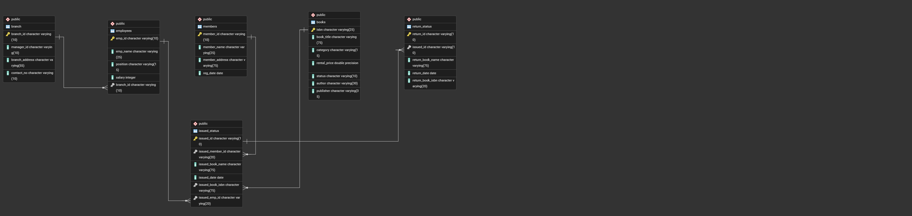

# Library Management System (SQL)

##  Overview

A relational database project built using **PostgreSQL** to simulate a real-world library system.
It manages books, members, employees, and transactions while enabling analytical insights through SQL.

---

##  Project Focus

* Relational database design
* Writing efficient SQL queries
* Analyzing operational data (usage, performance, trends)

---

##  Tech Stack

* PostgreSQL
* SQL
* pgAdmin4
* CSV datasets

---

##  Data Model

The system is structured around core entities such as books, members, employees, and transactions, ensuring data consistency and efficient querying.

###  Entity Relationship Diagram (ERD)



---

##  Key Capabilities

* Track book issuance and returns
* Manage members and employees
* Analyze branch-level performance
* Generate insights using advanced SQL queries

---

##  Highlight Queries

###  Overdue Books Analysis

```sql
SELECT 
    m.member_name,
    b.book_title,
    CURRENT_DATE - ist.issued_date AS overdue_days
FROM issued_status ist
JOIN members m ON m.member_id = ist.issued_member_id
JOIN books b ON b.isbn = ist.issued_book_isbn
LEFT JOIN return_status rs ON rs.issued_id = ist.issued_id
WHERE rs.return_date IS NULL
AND (CURRENT_DATE - ist.issued_date) > 30;
```

---

###  Branch Performance Report

```sql
SELECT 
    br.branch_id,
    COUNT(ist.issued_id) AS total_issued,
    COUNT(rs.return_id) AS total_returned,
    SUM(b.rental_price) AS revenue
FROM issued_status ist
JOIN employees e ON e.emp_id = ist.issued_emp_id
JOIN branch br ON br.branch_id = e.branch_id
LEFT JOIN return_status rs ON rs.issued_id = ist.issued_id
JOIN books b ON b.isbn = ist.issued_book_isbn
GROUP BY br.branch_id;
```

---

###  Top Employees by Transactions

```sql
SELECT 
    e.emp_name,
    COUNT(ist.issued_id) AS books_processed
FROM issued_status ist
JOIN employees e ON e.emp_id = ist.issued_emp_id
GROUP BY e.emp_name
ORDER BY books_processed DESC
LIMIT 3;
```

---

###  Revenue Analysis by Category

```sql
SELECT 
    b.category,
    SUM(b.rental_price) AS revenue
FROM issued_status ist
JOIN books b ON b.isbn = ist.issued_book_isbn
GROUP BY b.category
ORDER BY revenue DESC;
```

---

###  Stored Procedure (Book Issue Logic)

```sql
CREATE OR REPLACE PROCEDURE issue_book(
    p_issued_id VARCHAR,
    p_member_id VARCHAR,
    p_isbn VARCHAR,
    p_emp_id VARCHAR
)
LANGUAGE plpgsql
AS $$
DECLARE
    v_status VARCHAR;
BEGIN
    SELECT status INTO v_status FROM books WHERE isbn = p_isbn;

    IF v_status = 'yes' THEN
        INSERT INTO issued_status 
        VALUES (p_issued_id, p_member_id, CURRENT_DATE, p_isbn, p_emp_id);

        UPDATE books SET status = 'no' WHERE isbn = p_isbn;
    ELSE
        RAISE NOTICE 'Book not available';
    END IF;
END;
$$;
```

---

##  Outcomes

* Designed a normalized relational database
* Applied advanced SQL concepts in a practical system
* Extracted insights from transactional data

---

##  Setup

1. Import CSV datasets into PostgreSQL
2. Run the database schema SQL file
3. Execute query scripts for analysis

---

##  Author

Aryan Gupta


